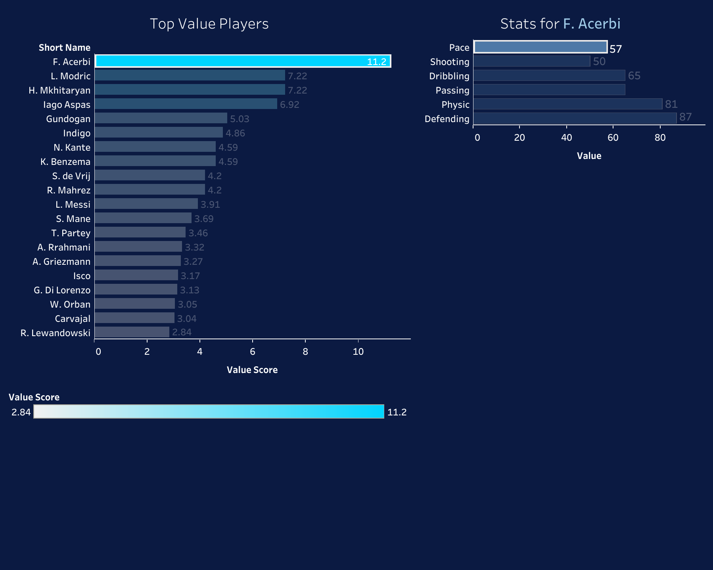

# EA Sports FC 26 Market Analysis: Finding Value in Ultimate Team ⚽📊

**Author:** Seif NourElDeen
**Date:** December 2025
**Tools Used:** SQL (BigQuery), Tableau, Excel
**Data Source:** [FC 26 Player Data on Kaggle](https://www.kaggle.com/datasets/rovnez/fc-26-fifa-26-player-data)

## 🔗 Project Links

- **Dashboard Preview:**  
- **Interactive Dashboard:** [View Dashboard Here](https://public.tableau.com/views/EASportsFC26MarketAnalysis-SeifNourElDeen/Dashboard1?:language=en-US&:sid=&:redirect=auth&:display_count=n&:origin=viz_share_link)
- **Full Report (PDF):** [View the Report Here](FC26_Market_Analysis_Report.pdf)

## 📌 Executive Summary
This project analyzes the EA Sports FC 26 transfer market to identify inefficiencies and "undervalued" players. By analyzing over 18,000 player items, I developed a "Value Score" algorithm to help users maximize their budget.

## 🔍 Key Findings
1.  **The Premier League Tax:** Players in the Premier League cost ~40% more than statistically identical players in Serie A or La Liga.
2.  **Positional Bias:** The market overvalues "Pace" and Strikers, while Goalkeepers and Defensive Midfielders offer the highest ROI (Return on Investment).
3.  **The "Hidden Gem" Algorithm:** Using SQL, I identified the Top 20 players who offer Elite-tier stats (>85) for budget prices (<5,000 coins).

## 🛠️ Technical Steps
- **Data Cleaning (SQL):** Removed 109 invalid rows (Free Agents/Nulls) to ensure data integrity.
- **Analysis (SQL):** Calculated `Cost Per Point` and `Value Score` metrics using aggregate functions.
- **Visualization (Tableau):** Built an interactive dashboard with Action Filters to allow dynamic player profiling.
